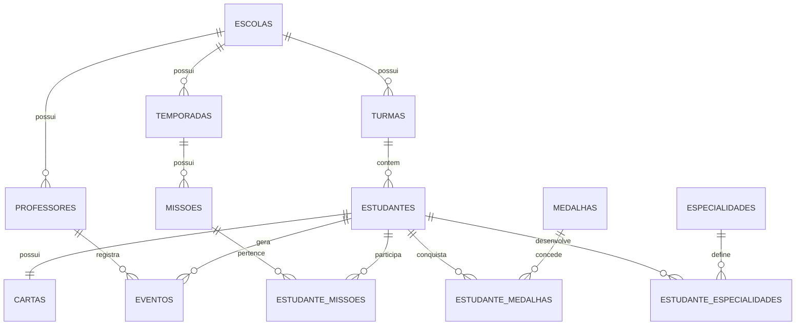

# SkillEduCards

# Diagrama Entidade Relacionamento (ER)

Versão: 0.1.0-alpha

---

---

# Filosofia

O SkillEduCards utiliza uma arquitetura baseada em eventos.

Toda evolução do estudante é registrada como um evento.

O XP, nível, medalhas e dashboards são derivados desses registros.

---

# Entidade Central

ESTUDANTE

↓

EVENTOS

↓

XP

↓

CARTA

↓

DASHBOARD

---

# Benefícios

- Histórico completo
- Auditoria
- Evolução permanente
- Dashboards inteligentes
- Futuras análises por IA
